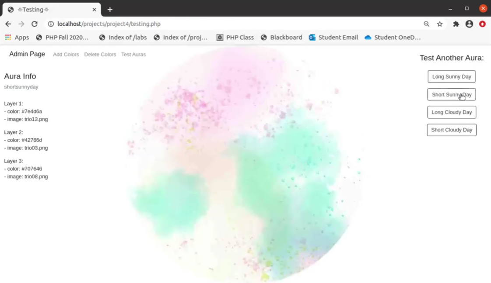

# dailysunaura
Sunlight Illustration Generator

PHP Web Application with Bootstrap 4 and MySQL

*** IMP: this project won't work for you unless you obtain your own API key from openweathermap.org, and dowload Composer and Guzzle.  Please check out this YouTube walkthrough to see the project in greater detail: https://youtu.be/rwOJTNuAb2g ***

Daily Sun Aura is a web application I created that uses a web service (API) to illustrate the amount of daily sunlight in the selected location (zip code). Colors and images (that I created in Photoshop) are chosen randomly within the parameters of: if it's clear or cloudy, and the total number of daylight hours of the current day. The images are colorized with CSS, rotated semi-randomly, and layered, creating a unique aura!

The user can click on the aura to generate another aura (fun!) that uses the same inputs, or go back to try generating from another location (zip code).

Daily Sun Aura also includes a password protected admin page. The admin page contains utilities to select and add more sets of colors to the database, delete sets of colors, and test the auras (shows all aura information).

Reference: I used a Stack Overflow page that taught me how to "colorize" an image which greatly influenced this project: https://stackoverflow.com/questions/29458666/emulate-photoshops-color-overlay-using-css-filters

Created by Sadie Sturgeon, December 2020

